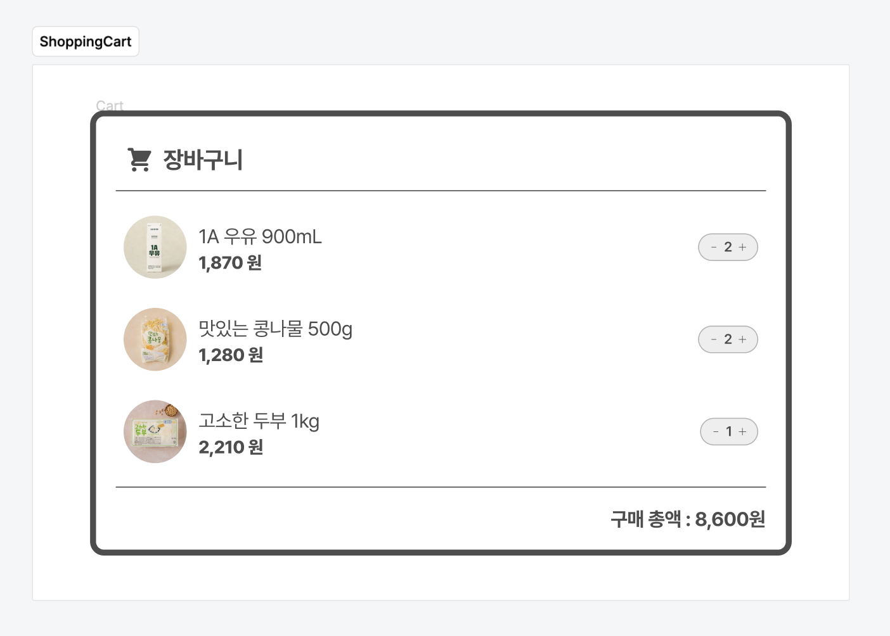

# 실습

[Figma 디자인 시안](https://www.figma.com/file/wYkx9bTZxxcxcPruUYcZ3x/EXERCISES?type=design&node-id=573%3A499&mode=design&t=iHyKcMhuPhMC7mi2-1)을 분석해 ShoppingCart 컴포넌트를 구현합니다.



<br />

<details>
  <summary>cart.json</summary>

  ```json
  "items": [
    {
      "id": "03pf1ftoh9jzjbv",
      "name": "1A 우유 900mL",
      "photo": "product-milk.jpg",
      "price": 1870,
      "quantity": 2,
      "inventory": 13,
    },
    {
      "id": "3hnp0i8jearc79z",
      "name": "맛있는 콩나물 500g",
      "photo": "product-bean-sprouts.jpg",
      "price": 1280,
      "quantity": 2,
      "inventory": 6,
    },
    {
      "id": "mkagdp08gi7pf5i",
      "name": "고소한 두부 1kg",
      "photo": "product-tofu.jpg",
      "price": 2210,
      "quantity": 1,
      "inventory": 5,
    },
  ]
  ```
</details>

