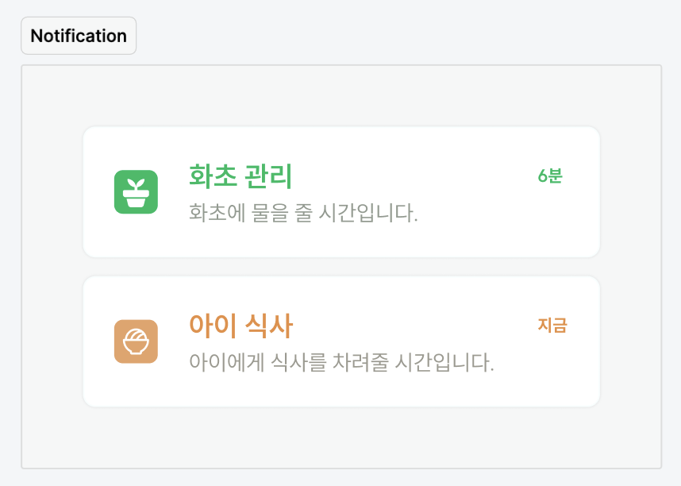

# 실습

[Figma 디자인 시안](https://www.figma.com/file/wYkx9bTZxxcxcPruUYcZ3x/EXERCISES?type=design&node-id=618%3A224&mode=design&t=jsMrC7lelWoqbCLv-1)을 분석해 Notification 컴포넌트를 구현합니다.

다음 요구사항에 맞춰 구현해봅니다.

- [ ] 모드 2가지 : `plant`, `cooking`
- [ ] CSS 모듈을 활용해 스타일링

