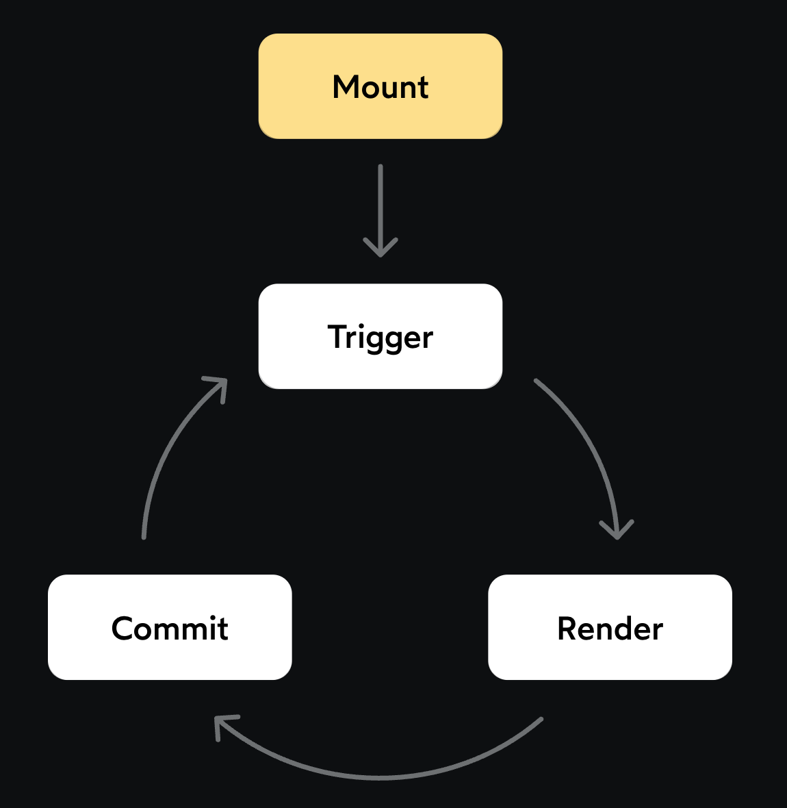

[← 뒤로](../README.md)

## 학습 주제

<!-- - [ ] 엑서사이즈 - 쇼핑 카트 테이블 -->
- [x] 조건부 렌더링
  - [x] JavaScript 객체 합성의 함정에 유의 (스타일 확장 : `className`, `style`, `restProps`)
- [x] 컴포넌트 독립 테스트 - Storybook 소개
- [x] 엑서사이즈 - 배지(badge) 렌더링 (render list, conditional rendering)
- [x] 엑서사이즈 - 그래프(Graph)
<!-- - [ ] 엑서사이즈 - 노티피케이션(Notification) -->
<!-- - [ ] 엑서사이즈 - 그리드(Grid) -->
- [x] 이벤트 핸들링 - HTML vs. JSX
  - [x] HTML 속성 이름이 모두 소문자 (`onclick`) vs. JSX는 on* 시작하는 camelCase 포멧 (`onClick`)
  - [x] HTML 속성 값은 문자(`="print()"`) vs. JSX는 이벤트 prop 값은 이벤트 핸들러(함수) 참조(`={print}`)
  - [x] 이벤트 전파 중지(stop propagation: `e.stopPropagation()`)
- [x] 이벤트 핸들링 - 이벤트 핸들러에 인수 지정 (JS, Closure: `(payload) => (e) => {}`)
<!-- - [ ] 엑서사이즈 - 미니 게임 "폭탄을 피하라!" -->
- [x] 상태 관리
  - [x] 상태란? "시간에 따라 변하는 값"
  - [x] 재조정이란? "무언가 변경되었는지 확인하고 다시 그림"
  - [x] React.useState 훅 (hooks 리액트에서 특별한 함수 : 리액트 훅, trigger) 
    - [x] 배열 구조 분해 할당 `[value, setValue]`
    - [x] 이름 작성 규칙 (관례) `[name, setName] | [age, updateAge]`
  
### 리액트의 작동 흐름

리액트의 작동 흐름을 시각화하면 아래 이미지와 같습니다.
  

## 코드 정리 & 추가 학습

- [x] Storybook 구성 
  - [x] [설치](https://storybook.js.org/docs/get-started/install)
  - [x] [스토리란?](https://storybook.js.org/docs/get-started/whats-a-story)
  - [x] [문서화](https://storybook.js.org/docs/writing-docs/autodocs)