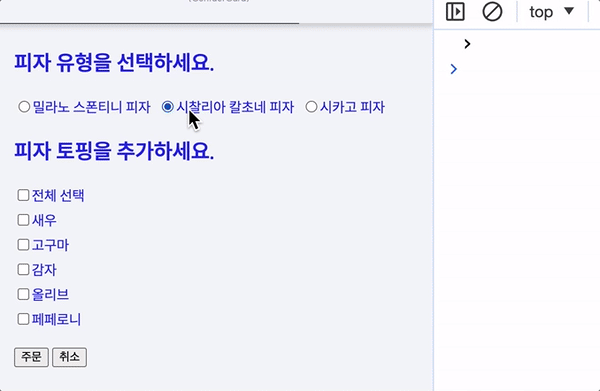

[← 뒤로](../README.md)

## 학습 주제

- [x] Stack 컴포넌트 (레이아웃)
- [x] 폼(Form) 컨트롤
  - [x] 피자 주문 폼 (멀티 체크박스)
  - [x] 실시간 검색 폼 (리액트 제어 방식)
  - [x] 입력에 따른 리-렌더 디바운싱
- [x] 사이드 이펙트란?

### 피자 주문 정보

피자 주문 폼을 작성합니다.

- 타입 : 밀라노 스폰티니 피자, 시찰리아 칼초네 피자, 시카고 피자
- 토핑 : 새우, 고구마, 감자, 올리브, 페페로니



### 논리적 흐름에 맞는 상태 확인

토핑 멀티 체크박스 예제에서 제한된 횟수 이상 체크하려는 경우, 
사용자에게 경고하는 방법이 논리적으로 구성되도록 코드를 수정합니다.

<details>
  <summary>src/lecture/38-stack-layout-component.jsx</summary>

  ```jsx
  const handleChangePizzaToppings = (e) => {

    // 이벤트 대상의 체크 여부를 사용하는 것은 논리적 흐름 상 반대로 작동한다.
    const { value: topping, /* checked: isChecked */ } = e.target;

    // 리액트 상태로부터 토핑 정보가 포함되어 있는지를 확인하는 것이 논리적이다.
    const toppingChecked = orderState.toppings.includes(topping);

    // 체크박스를 눌렀을 때, 화면에 표시되는 현재 토핑의 상태를 확인할 수 있다.
    // console.log(toppingChecked);

    // 체크된 토핑의 총 갯수가 제한 횟수만큼 충족하고, 
    // 사용자가 누른 토핑이 체크되어 있지 않다면?
    // 토핑 선택의 제한 횟수를 안내하고 함수를 종료한다.
    if (orderState.toppings.length === 3 && !toppingChecked) {
      return alert('토핑 선택은 3개만 가능합니다.');
    }

    let nextToppings = [];

    if (!toppingChecked) {
      // 토핑 추가
      nextToppings = [...orderState.toppings, topping];
    } else {
      // 토핑 삭제
      nextToppings = orderState.toppings.filter((t) => t !== topping);
    }

    const hasFullFilledToppings = nextToppings.length === PIZZA.toppings.length;

    const nextOrderState = {
      ...orderState,
      toppings: nextToppings,
      isAllToppings: hasFullFilledToppings,
    };

    setOrderState(nextOrderState);
  };
  ```
</details>

## 코드 정리 & 추가 학습

- [x] [RAWG](https://rawg.io) → 비디오 게임 데이터베이스 API 계정 생성 및 API 키 발급
- [x] Vite → Tailwind CSS 설치/구성 ([참고](https://tailwindcss.com/docs/guides/vite))
- [x] Vite → "빌드 타임 임포트" 설정 ([참고](https://tailwindcss.com/docs/using-with-preprocessors#build-time-imports))

### 빌드 타임 임포트란?

프리 프로세서가 제공하는 가장 유용한 기능 중 하나는 CSS 스타일을 여러 파일로 구성하고 
브라우저 대신, `@import` 명령문을 미리 처리해 빌드 시 이를 결합하는 기능입니다.

PostCSS로 해당 기능을 사용하려면 [postcss-import](https://github.com/postcss/postcss-import) 플러그인을 설치해야 합니다.

해당 플러그인을 사용하면 여러 파일로 구성된 CSS 스타일을 `@import` 명령문으로 빌드 과정에서 결합할 수 있습니다.

```css
/* Tailwind CSS 기본 스타일 모듈  */
@import "tailwindcss/base";
/* 사용자 정의 기본 스타일 모듈  */
@import "./custom-base-styles.css";

/* Tailwind CSS 컴포넌트 스타일 모듈  */
@import "tailwindcss/components";
/* 사용자 정의 컴포넌트 스타일 모듈  */
@import "./custom-components.css";

/* Tailwind CSS 유틸리티 스타일 모듈  */
@import "tailwindcss/utilities";
/* 사용자 정의 유틸리티 스타일 모듈  */
@import "./custom-utilities.css";
```